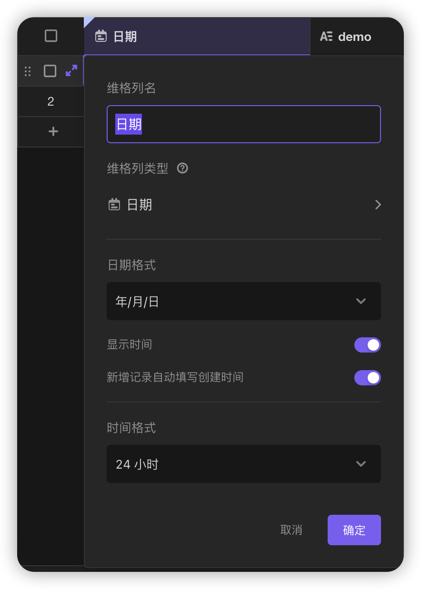
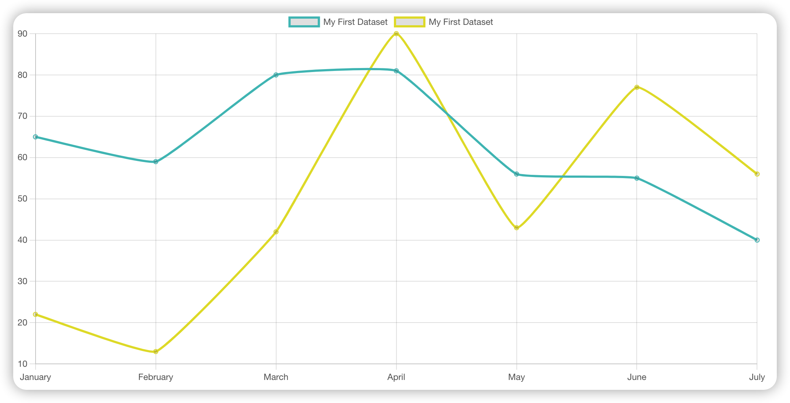

# 项目初始化

```sh
npm create vite@latest my-vue-app --template vanilla-ts
npm install @vikadata/vika@latest chart.js
```

## 约定

在撰写具体代码前，必须遵从以下约定

- 填写 vika 表单时，必须填写所有问题
- vika 默认必须要有一个字段，将该字段命名为日期，其具体配置如下 
- 日期字段外的任意字段，将作为折线图数据来源

## data adapter

使用 vika 获取数据，将数据修改为 chart js 可用的形式

### Chart JS

Chart JS 接收对象基础结构

- labels: 横坐标点
- datasets
  - label: 色块
  - data: 每个点的纵坐标

```js
const labels = Utils.months({ count: 7 });
const data = {
  labels: labels,
  datasets: [
    {
      label: "My First Dataset",
      data: [65, 59, 80, 81, 56, 55, 40],
      fill: false,
      borderColor: "rgb(75, 192, 192)",
      tension: 0.1,
    },
    {
      label: "My First Dataset",
      data: [22, 13, 42, 90, 43, 77, 56],
      fill: false,
      borderColor: "rgb(228, 221, 50)",
      tension: 0.1,
    },
  ],
};
```



### Vika Response

vika api 模拟数据

```js
const data = [
  {
    recordId: "recLZAdf6c0Pk",
    createdAt: 1654059455000,
    updatedAt: 1654085767000,
    fields: { 模拟日期: 1654017240000, 饱腹程度: "1" },
  },
  {
    recordId: "recBKNxpxrIH5",
    createdAt: 1654059763000,
    updatedAt: 1654085767000,
    fields: { 模拟日期: 1654103640000, 饱腹程度: "2" },
  },
  {
    recordId: "recmBTCLN4HaE",
    createdAt: 1654060764000,
    updatedAt: 1654085767000,
    fields: { 模拟日期: 1654233540000, 饱腹程度: "3" },
  },
];
```

## render

初始化 chart js

1. 选定挂载的 canvas 元素
2. 配置 chart 选项。配置类型、大小、线条颜色等

```js
const colorSet = {
  lightgray: "#d3d3d3",
  darkslategray: "#2f4f4f",
  maroon2: "#7f0000",
  darkgreen: "#006400",
  darkkhaki: "#bdb76b",
  yellowgreen: "#9acd32",
  lightseagreen: "#20b2aa",
  purple: "#800080",
  red: "#ff0000",
  darkorange: "#ff8c00",
  gold: "#ffd700",
  mediumblue: "#0000cd",
  lime: "#00ff00",
  mediumspringgreen: "#00fa9a",
  royalblue: "#4169e1",
  deepskyblue: "#00bfff",
  fuchsia: "#ff00ff",
  plum: "#dda0dd",
  deeppink: "#ff1493",
  lightsalmon: "#ffa07a",
};
```

## 集成至 raycast

# 注意

- vika 不会返回未填写的字段，因此必须遵守 [约定](#约定) 中声明的内容
- chart js 支持 tree shaking，可以按需导入函数。但实际使用起来压根不知道要导入哪些内容，文档中也未写明。因此只能导入 chart js 中的所有内容。详见 [v3 component registration · Issue #8105 · chartjs/Chart.js](https://github.com/chartjs/Chart.js/issues/8105)

# 主观感受

- vika 文档写得很好
- chart js 有点坑。缺少引导，tree shaking 配置起来麻烦
